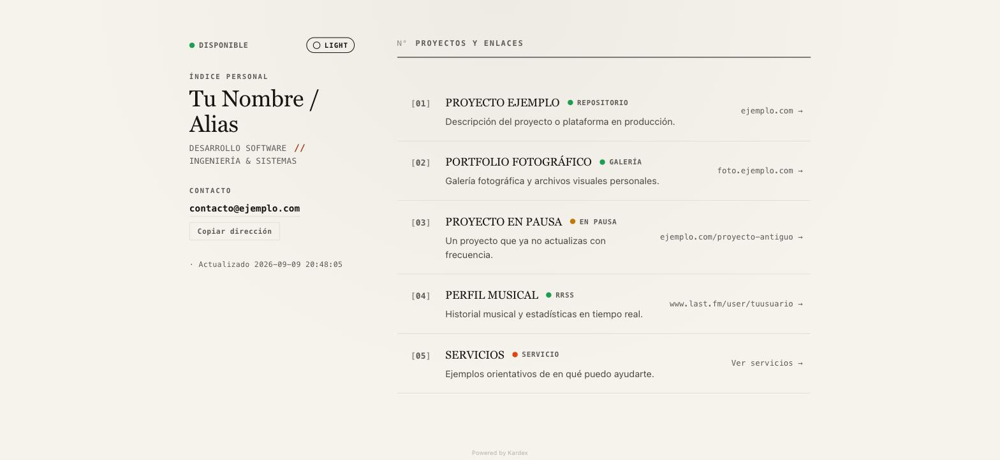

# Kardex

> Hub personal de proyectos y enlaces en formato "ficha de índice", con estética editorial (papel + tinta), modo claro/oscuro adaptativo y soporte Docker. Cero dependencias externas: sin fuentes ni scripts de terceros.

<p align="center">
  
</p>

---

## ✨ Características

- **Estética editorial propia:** tipografía serif + monoespaciada del sistema (sin Google Fonts ni CDNs externos), paleta papel/tinta con un único acento, sin los clichés de "terminal hacker" (grid de puntos, naranja neón, cursor parpadeante).
- **Layout en índice:** masthead fijo con identidad y contacto + listado de proyectos en formato ficha/índice, en vez de la típica tarjeta única centrada tipo Linktree.
- **Adaptativo Claro/Oscuro:** vía `prefers-color-scheme` y la función CSS `light-dark()` (un único set de tokens de color, sin duplicación), con toggle manual opcional y sin parpadeo de tema al recargar.
- **100% Vanilla y sin build:** HTML5, CSS3 y JavaScript vanilla. Configuración y contenido separados de la lógica en `config.js`.
- **Accesible:** navegación por teclado, `aria-live` en el copiado de correo, skip-link, `prefers-reduced-motion`, y fallback completo sin JavaScript.
- **SEO / PWA listo:** Open Graph, Twitter Card, `manifest.json`, `robots.txt`, `sitemap.xml` e iconos para instalar como app.
- **Docker listo:** imagen `nginx:1.27-alpine` con Gzip, cache headers, `HEALTHCHECK` y cabeceras de seguridad.

---

## 🚀 Inicio rápido con Docker

```bash
docker compose up -d --build
```

Accede en: **`http://localhost:8090`**

Para detenerlo:
```bash
docker compose down
```

---

## 🛠️ Configuración

Toda tu personalización vive en [`public/config.js`](public/config.js) — no necesitas tocar `script.js` ni `style.css`. El archivo está pensado para ser lo más cómodo posible de editar a mano: cada campo tiene su explicación al lado, y solo hay que añadir/quitar/reordenar bloques dentro de `UNITS`.

**Para aplicar un cambio:** con el contenedor ya levantado (`docker compose up -d`), solo tienes que:
1. Editar `public/config.js` en tu editor de texto y guardar.
2. Recargar la pestaña del navegador (F5).

Nada más — no hace falta reconstruir Docker ni tocar ningún número de versión. `docker-compose.yml` monta la carpeta `public/` completa dentro del contenedor, así que este siempre sirve lo último que tengas guardado en disco. Solo necesitas volver a ejecutar `docker compose up -d --build` si cambias `Dockerfile` o `nginx.conf` (la parte de infraestructura, no el contenido).

```javascript
const SITE_CONFIG = {
  operatorName: "Tu Nombre / Alias",
  operatorRole: "DESARROLLO SOFTWARE // INGENIERÍA & SISTEMAS",
  contactEmail: "contacto@ejemplo.com",
  availability: {
    type: "disponible",  // opcional, ver tabla "Disponibilidad personal" abajo
    label: "DISPONIBLE"  // opcional, texto libre
  }
};

const UNITS = [
  {
    name: "PROYECTO EJEMPLO",              // obligatorio
    url: "https://ejemplo.com",            // obligatorio
    description: "Plataforma en producción.", // opcional
    type: "activo"                          // opcional (por defecto "activo")
  }
  // añade tantos bloques como quieras, separados por comas
];
```

Fíjate en lo que **no** hay que escribir: no hace falta numerar los proyectos (`01`, `02`...) — el índice se calcula solo según el orden de la lista, así que reordenar, borrar o insertar un proyecto en medio nunca rompe la numeración. Tampoco hace falta `displayUrl` (se genera solo desde `url`) ni `label` (cada `type` ya tiene un texto por defecto).

### `type` es la fase, `label` es la categoría — son independientes
`type` controla **solo** el color del punto y describe el ciclo de vida del proyecto (activo, en desarrollo, en pausa...). Para mostrar de qué trata el enlace (un repositorio, tu música, un servicio...), usa `label` — es texto libre y no cambia el color. Puedes combinar cualquier `label` con cualquier `type`:

```javascript
{ type: "activo",       label: "REPOSITORIO" }  // punto verde, texto "REPOSITORIO"
{ type: "proximamente", label: "SERVICIO" }      // punto naranja, texto "SERVICIO"
```

Esto es lo que hace posible anunciar, por ejemplo, un servicio que aún no está listo (`type: "proximamente"`) sin perder el texto que dice que es un servicio (`label: "SERVICIO"`) — antes tenías que elegir uno u otro.

### Cambiar el orden sin mover bloques
Si solo quieres que un proyecto aparezca más arriba, no hace falta cortar y pegar su bloque dentro de la lista: añádele `order` con el número de posición que quieres (1 = primero).

```javascript
{
  name: "GITHUB",
  order: 1,   // pasa a ser el primero, sin tocar el resto de la lista
  url: "https://github.com/tuusuario",
  ...
}
```

Los proyectos sin `order` rellenan los huecos restantes en su orden habitual. Si dos proyectos piden la misma posición, gana el que esté antes en la lista.

### Fases de PROYECTO (`type` dentro de `UNITS`):
| `type` | Color del indicador | Etiqueta por defecto |
|--------|----------------------|-----------------------|
| `activo` | Verde | ACTIVO |
| `desarrollo` | Azul | EN DESARROLLO |
| `pausa` | Ámbar | EN PAUSA |
| `proximamente` | Naranja | PRÓXIMAMENTE |
| `inactivo` | Gris neutro | INACTIVO |

Si escribes tu propio `label`, sustituye al texto por defecto de la tabla, pero solo `type` determina el color.

### Disponibilidad personal (`type` dentro de `availability`)
Este es un catálogo **distinto** al de arriba: no describe el estado de un proyecto, sino si tú estás disponible ahora mismo. Como con los proyectos, `label` es libre y sustituye al texto por defecto — escribe lo que quieras, `type` solo decide el color.

| `type` | Color del indicador | Etiqueta por defecto |
|--------|----------------------|-----------------------|
| `disponible` | Verde | DISPONIBLE |
| `ocupado` | Ámbar | OCUPADO |
| `vacaciones` | Violeta | DE VACACIONES |
| `no-disponible` | Gris neutro | NO DISPONIBLE |

Nota: `online`/"ACTIVO" indica que el **proyecto** está activo, no que la web en sí esté disponible. Por ejemplo, una web puede seguir respondiendo (online técnicamente) mientras el proyecto detrás está en pausa — en ese caso usa `type: "standby"`, no `"online"`.

### Ofrecer un bien o servicio (con enlace externo y precio)
Para un proyecto que en realidad es algo que ofreces (no un enlace a tu propio trabajo), pon `label: "SERVICIO"` (o el texto que prefieras) con `url` apuntando a otra web donde se explica en detalle, y elige el `type` según si ya está disponible o no. El campo opcional `priceRange` añade un precio o rango de precios junto al indicador:

```javascript
{
  name: "DESARROLLO WEB A MEDIDA",
  url: "https://otra-web-donde-se-explica.com",
  description: "En qué consiste, en una frase.",
  type: "activo",        // o "proximamente" si aún no está listo
  label: "SERVICIO",
  priceRange: "Desde 300€"   // opcional; funciona con cualquier type
}
```

### Tema de color
`theme` en `config.js` controla la paleta del sitio. Cada opción trae ya coordinadas su versión clara y su versión oscura — cuál de las dos ves depende de tu sistema o del botón de tema (arriba a la derecha), no de esto. Opcional — por defecto es `"azul"`.

| `theme` | Claro | Oscuro |
|---------|-------|--------|
| `terracota` | Papel crema + acento terracota | Tinta cálida casi negra + terracota claro |
| `vino` | Blanco con tinte vino + acento vino | Negro con tinte vino + vino claro |
| `mostaza` | Blanco con tinte dorado + acento mostaza | Negro con tinte dorado + mostaza claro |
| `azul` (por defecto) | Blanco azulado + acento azul marino profundo | Negro azulado + azul claro |
| `petroleo` | Blanco verde-azulado + acento petróleo | Negro verde-azulado + petróleo claro |
| `monocromo` | Blanco puro, sin color de acento | Negro puro `#000000` (ideal para OLED), sin color de acento |

`azul` usa un azul marino/índigo profundo, no un azul claro o frío — pensado para que no resulte gélido junto a la tipografía serif del resto del sitio.

### Título de la pestaña
`pageTitle` en `config.js` controla el título de la pestaña del navegador. Es opcional: si lo quitas, se genera solo como `"{operatorName} — Índice"`.

Ojo: esto **no** cambia la vista previa cuando compartes el enlace en redes sociales (WhatsApp, Twitter/X, etc.) — esa usa `og:title`/`twitter:title`, que están fijos en `public/index.html` porque los bots que generan esas previsualizaciones no ejecutan JavaScript. Si quieres cambiar también eso, edita esas líneas directamente en `index.html`.

### Meta tags y dominio
Antes de publicar, actualiza el dominio de ejemplo en `public/index.html` (`og:url`, `canonical`), `public/robots.txt` y `public/sitemap.xml`.

---

## 📂 Estructura del proyecto

```
Kardex/
├── public/                  # Todo lo que se sirve tal cual en el navegador
│   ├── index.html            # Estructura semántica, meta tags OG/Twitter, noscript fallback
│   ├── style.css              # Design system: tokens light-dark(), layout, componentes
│   ├── config.js              # Tu identidad, contacto y proyectos — edita solo este archivo
│   ├── script.js               # Renderizado, gestión de tema y copiado — lógica, no toques datos aquí
│   ├── favicon.svg              # Marca vectorial (tarjeta de índice)
│   ├── preview.jpg               # Captura usada en el README y como og:image
│   ├── icons/                     # apple-touch-icon.png, icon-192.png, icon-512.png
│   ├── manifest.json               # Manifest PWA (instalable)
│   ├── robots.txt                   # Directivas para crawlers
│   └── sitemap.xml                   # Sitemap básico
├── Dockerfile                # Imagen de producción nginx:1.27-alpine
├── nginx.conf                 # Gzip, cache headers y cabeceras de seguridad
├── docker-compose.yml           # Monta public/ dentro del contenedor (puerto 8090:80)
└── .dockerignore
```

`public/` es la única carpeta que necesitas tocar para personalizar el contenido; todo lo que está fuera es infraestructura (Docker/nginx) que casi nunca hace falta modificar.

---

## 📄 Licencia

Licencia MIT. Úsalo y personalízalo libremente para tu propio hub personal.
